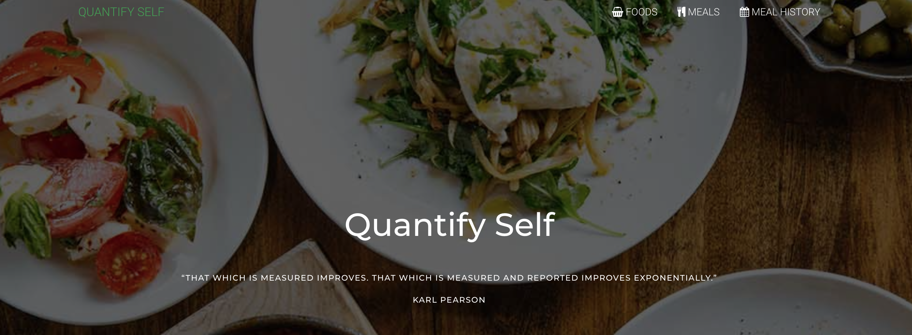
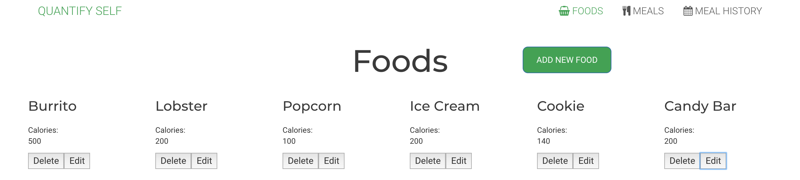
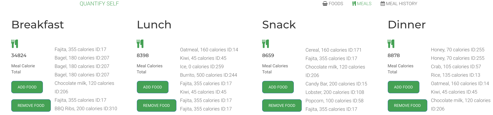
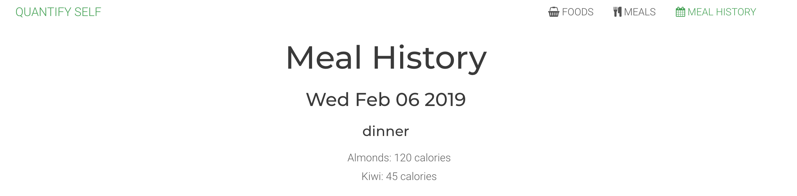

# Quantify Self (Front-End)



Quantify Self is a website that helps you manage and assess your caloric intake by meal. Visit https://amypetrie.github.io/quantified_self_fe/ for a live user experience.

## ⚙️ Initial Setup
OS X & Linux:

```sh
npm install
open index.html
```
## 🕹 Features
A user adds individual foods to a main Foods index. These foods are available to be added to meals.


A user has four daily meals and can dynamically add foods to meals from the existing Foods index. Calories are compared and measured across meals, and a daily goal of 2000 calories.


The user can see a history of all past meals and foods, by date.


## 🚧 Known Issues
Known issues, planned enhancement, and statuses can be found on our GitHub project board.

Current known issues include:
- Daily meals section does not update by date
- User is unable to delete a food from a specific meal

Planned enhancements include:
- Add Webpack to bundle files

## 🏗 Tech Stack List
- JavaScript
- Node.js

## 📥 How To Contribute
1. Fork this repo
2. Create your feature branch (`git checkout -b feature/thingamajig`)
3. Commit your changes (`git commit -am 'Added a cool doodad!'`)
4. Push to the branch (`git push origin feature/thingamajig`)
5. Create a new Pull Request

## 🚀 Core Contributors
**Amy Petrie**
Github:[https://github.com/amypetrie/](https://github.com/amypetrie/)
LinkedIn:[https://www.linkedin.com/in/amy-petrie/](https://www.linkedin.com/in/amy-petrie/)
**Norm Schultz**
Twitter:[@normanrs](https://twitter.com/normanrs)
Github:[https://github.com/normanrs](https://github.com/normanrs/)
Web:[http://www.normanrschultz.com](http://www.normanrschultz.com)
